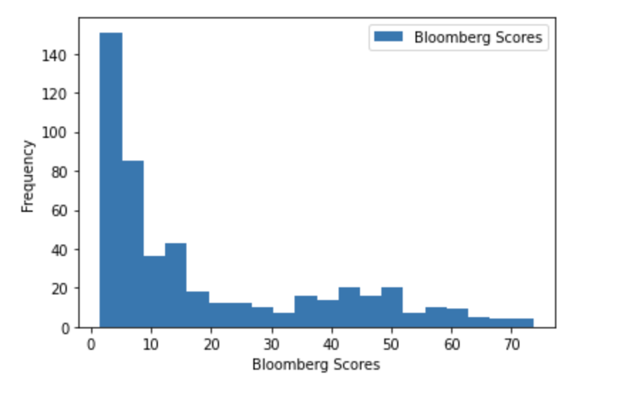
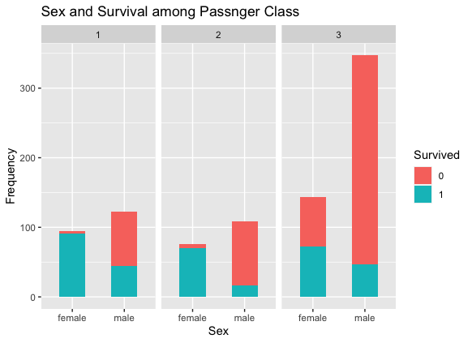

# Ali_Portfolio
Data Science Projects 

## Project1: NLP & Climate Risk: Project Overview
Climate risk is a financial risk that however is very difficult to quantify and it requires alternative approach. There are no standardized environment-related
disclosures from the different companies active in the market. Some companies that are taking into account climate risk in their business model, risk management and are reporting past incurred losses, future strategies, possible opportunities etc, while others are still silent about the topic or just mention possible future plans. The purpose of this project is to quantify climate risk for different companies by reconstructing Bloomberg environmental scores which give companies different scores lowest 0 and highest 100 based on their transparency on tackling environmental issues.

### For more details, [click here](https://github.com/AliAljabri/NLP-EIP-Project-in-Python)

----------------------------
## Project2: Time Series Forecasting : Project Overview

This project will use two different time series models Autoregressive Integrated Moving Average (ARIMA) model and Generalized Autoregressive Conditional Heteroskedasticity (GARCH) model in forecasting the returns of the SPY ETF which tracks the of the S&P 500. Time series will be fitted from the end of March 2019 to the end of September 2020 using the aforementioned models which will be used to forecast the short term returns of SPY during the beginning of October 2020. The purpose of forecasting is to find out if there are predictive buying and selling signals.

### For more details, [click here](https://github.com/AliAljabri/Time-Series-Forecasting)
----------------------------
## Project 3: Prediction of Titanic's Passenger Survival with Machine Learning: Project Overview 
The purpose of this project is to examine the predictive performance of different machine learning methods: linear discriminant analysis, logistic regression and random forests on which passenger survived the Titanic shipwreck.
The data contains so many variables and some of them seems useful in predicting survival and some not. Thus, each variable is analyzed and visualized using the training set to see if there is pattern in survival, and then determine to include this variable or not in our models. For example, variables passenger class and sex seem to have a pettern as shown below where passengers on the first class have a higher survival rate from any other class.

### For more details, [click here](https://github.com/AliAljabri/Machine-Learning-Project-in-R)

